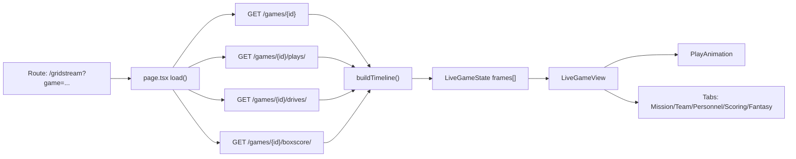
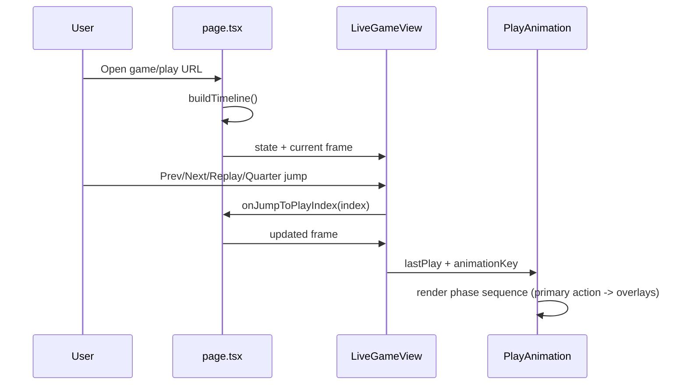

# Gridstream Live Runtime

This page documents how `/gridstream` is assembled today so future API docs
and architecture docs stay aligned with implementation.

## Data Flow



## Replay Sequence



## Structurizr Seed (DSL)

```dsl
workspace "Engineering Atlas" "Gridstream runtime" {
  model {
    user = person "User"
    web = softwareSystem "Web Next UI" {
      route = container "Gridstream Route" "Builds replay timeline and frame state" "Next.js"
      ui = container "Gridstream Components" "Score bug, field, tabs, controls" "React"
    }
    api = softwareSystem "Gridstream API" {
      rest = container "REST Endpoints" "games, plays, drives, boxscore" "Django REST Framework"
    }
    user -> web.ui "Views and controls replay"
    web.route -> api.rest "Fetches game data"
    web.route -> web.ui "Provides frame state"
  }
}
```

## OpenAPI / Swagger Checklist

- Add `drf-spectacular` and wire schema + Swagger/ReDoc routes.
- Annotate viewsets/actions in `apps/api-django/gridstream/views.py` with:
  - `@extend_schema_view(...)` for list/retrieve
  - `@extend_schema(...)` for custom actions (`live`, `plays`, `drives`, `boxscore`).
- Keep filter parameter docs synced with `apps/api-django/gridstream/filters.py`.
- Add concrete response examples for:
  - live scoreboard hydration
  - paginated play feed
  - boxscore payload with team/player stats.

## Starlight Note

If this doc moves into Starlight navigation later, add it as a regular content
page entry (for example under a `Gridstream` section) and keep the frontmatter
title stable so existing deep links continue to work.
